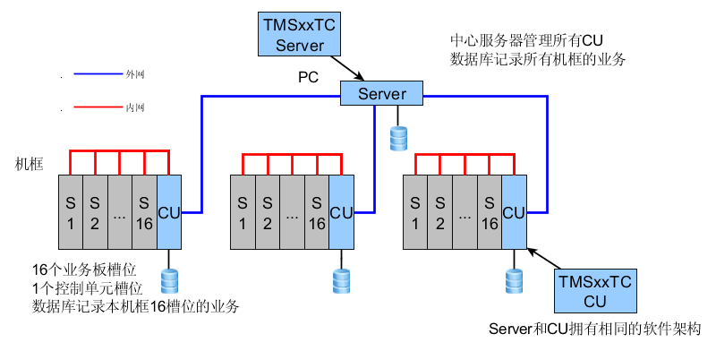
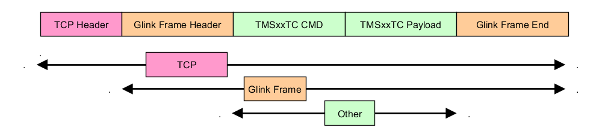
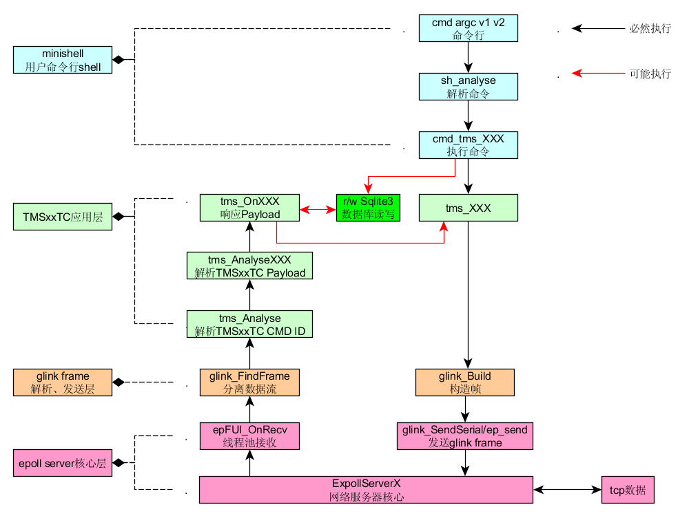

# 1 TMSxxTC光缆在线监测系统
本工程属于EpollServerX、minishellEx的具体应用项目。



## 1.1 性能

以下性能均以exynos 4412为运行平台
* 双网卡USB 2.0 DM9601 10/100Mbps
* 内存1GB（实际可用内存600MB）
* CPU 4核，采用频率1.5GHz（空闲时只开启单核）

* Server服务器能承受至少128个CU的连接以及突发数据	
	* 默认限制 **800** 个TCP连接，此限制可以通过服务器配置修改，理论上只于 **内存** 消耗有关。
		* Server静默状态消耗内存296KB
		* 800个连接消耗内存24.6MB

	* 服务器连接400客户端，所有客户端均含有心跳数据，客户端在30s以内没得到服务器响应则自动断开。
		* 其中10个客户端全速发送数据。服务器保持 **600KB/S** 吞吐量，10个客户端显示吞吐量 **200KB/S** 
		* **具体测试方法参考：** https://github.com/MenglongWu/NetStrong
		* 以上测试经过2周， **无任何客户端断开连接** ，并且10个客户端收到的服务器的 **响应ID号有序**

* CU采用轻量级数据库， **正常数据量** 查询和插入能在10s内完成
	* FLASH（eMMC）为存储介质插入40万条数据耗时80~90s
	* DDR2为存储介质插入40万条数据耗时5~10s


## 1.2 网络拓扑
系统由两个局域网组成，CU配置 **双网卡** 隔离内外网：

内外网之间采用 **iptable实现防火墙配置访问控制**，与CU在同一机框的业务板处于同一内网，并与该CU通过TCP连接。

外网是所有CU通过TCP连接Server

## 1.3 数据分离
Server与各CU拥有本地数据库，Server的数据库不能理解成是个CU数据库的汇总，CU的数据库记录的是本地16个业务板槽位的数据，采用这种分离方式目的在于当Server异常或外网崩溃后，CU依旧能通过读取本地数据库执行工作，保证光缆检测业务正常。

当Server恢复正常或外网通信正常后，CU将断网期间的差异数据上报到Server。

## 1.4 服务器架构
Server和CU采用相同的软件架构，差异仅仅是 **tms_OnXXX 回调函数对相同CMD ID下的Payload执行不同的处理流程** 。


## 1.5 帧格式




## 2 TMSxxTC软件架构



TMSxxTC分成4层，由下至上分别是：

* EpollServer TCP 网络服务器核心层
* glink frame协议解析、封装层
* TMSxxTC应用层
* UI层——minishell用户命令行解析shell

## 2.1 EpollServer TCP 网络服务器核心层
采用linux epoll 线程池机制，负责管理所有网络连接的状态


###相关代码
-
**内核部分**

git clone https://github.com/MenglongWu/EpollServerX.git

* osnet/bipbuffer.c
* osnet/epollserver.c
* osnet/ossocket.c

**与TMSxxTC相关部分**

* src/ep_app.c


## 2.2 glink frame协议解析、封装层
从数据流中提取到一帧glink帧，以及glink帧的封装

**相关代码**
-

* protocol/glink.c


## 2.3 TMSxxTC应用层
负责从glink帧里提取TMSxxTC相关的命令id(CMD ID)，并根据命令的内容(Payload)进行不同的处理，server和CU的软件架构仅仅是对Payload的处理流程有所差异。


####相关代码
-

**核心代码**

* protocol/tmsxx.c

**与Server/CU分别定制**

* src/tmsxx_app.c

## 2.4 UI层——minishell用户命令行解析shell
与用户交互的命令行接口，包括配置业务、查询故障、备份数据库等

####相关代码
-

**内核部分**

git clone https://github.com/MenglongWu/MiniShellEx.git

* shell/minishell_core.c

**与TMSxxTC相关**

* shell/cmd/cmd_server.c
* shell/cmd/cmd_tmsxx.c


# 3 运行状态

## 3.1 TMSxxTC Server/CU启动开放6000端口
```
_tmsdb_CreateTable_common :0
_tmsdb_CreateTable_sn :0
_tmsdb_CreateTable_sms :0
_tmsdb_CreateTable_composition :0
_tmsdb_CreateTable_dev_map :0
_tmsdb_CreateTable_any_unit_osw :0
_tmsdb_CreateTable_route :0
_tmsdb_CreateTable_a_trigger_b :0
_tmsdb_CreateTable_osw_cyc :0
_tmsdb_CreateTable_osw_cyc :0
_tmsdb_CreateTable_otdr_rollcall :0
_tmsdb_CreateTable_otdr_ref :0
_tmsdb_CreateTable_otdr_his_data :0
_tmsdb_CreateTable_otdr_alarm_data :0
Run server listening at: 0.0.0.0:6000
ep_AddClient: Success
ep_AddEvent: Success
ep_listen: Success

pid 31194 work thread id 0x405d6b70
MiniShell:>inf
Index      FD          locate                  Remote
1          4         0.0.0.0:6000             0.0.0.0:0 

```
## 3.2 CU等待16个槽位业务板连接

```
MiniShell:>
Frame:00 Slot count:15
----OnAccept----
       6   192.168.1.254:6000    <----     192.168.0.101:49154   2016-2-29 16:15:33
----OnAccept----
       5   192.168.1.254:6000    <----     192.168.0.106:49154   2016-2-29 16:15:33
----OnAccept----
      16   192.168.1.254:6000    <----     192.168.0.108:49154   2016-2-29 16:15:35
----OnAccept----
      15   192.168.1.254:6000    <----     192.168.0.107:49154   2016-2-29 16:15:35
----OnAccept----
       9   192.168.1.254:6000    <----     192.168.0.103:49154   2016-2-29 16:15:35
----OnAccept----
       8   192.168.1.254:6000    <----     192.168.0.104:49154   2016-2-29 16:15:37
----OnAccept----
      11   192.168.1.254:6000    <----     192.168.0.105:49154   2016-2-29 16:15:38
----OnAccept----
       7   192.168.1.254:6000    <----     192.168.0.102:49154   2016-2-29 16:15:41
----OnAccept----
      21   192.168.1.254:6000    <----     192.168.0.115:49154   2016-2-29 16:15:43
----OnAccept----
      22   192.168.1.254:6000    <----     192.168.0.110:49154   2016-2-29 16:15:43
----OnAccept----
      19   192.168.1.254:6000    <----     192.168.0.111:49154   2016-2-29 16:15:50
----OnAccept----
      23   192.168.1.254:6000    <----     192.168.0.112:49154   2016-2-29 16:15:52
----OnAccept----
      13   192.168.1.254:6000    <----     192.168.0.113:49154   2016-2-29 16:15:52
----OnAccept----
      14   192.168.1.254:6000    <----     192.168.0.109:49154   2016-2-29 16:15:52
----OnAccept----
      20   192.168.1.254:6000    <----     192.168.0.114:49154   2016-2-29 16:15:52
----OnAccept----
      24   192.168.1.254:6000    <----     192.168.0.116:49154   2016-2-29 16:15:53

MiniShell:>disp frame

Frame:00 Slot count:15
-----------------------------------------------------------------
|00 |01 |02 |03 |04 |05 |06 |07 |08 |09 |10 |11 |12 |13 |14 |15 |
-----------------------------------------------------------------
| O | O | O | O | O | O | O | O | O | O | O | O | O | O | O | O |
| T | T | T | T | S | P | P | P | S | L | L | L | L | T | T | T |
| D | D | D | D | W | M | M | M | W | P | P | P | P | D | D | D |
| R | R | R | R |   |   |   |   |   |   |   |   |   | R | R | R |
|   |   |   |   |   |   |   |   |   |   |   |   |   |   |   |   |
|00 |00 |00 |00 |00 |08 |00 |00 |00 |00 |00 |00 |00 |00 |00 |00 |
-----------------------------------------------------------------
Socket Fd:
00:06    01:07    02:09    03:08    04:11    05:05    06:15    07:16    
08:14    09:22    10:19    11:22    12:13    13:20    14:21    15:24    
                    Total Frame:01 Total Slot:15
```

## 3.3 Server连接两个CU

```
MiniShell:>connect 192.168.1.251 6000
Connect: Success
----OnConnect----
       33       192.168.1.52:59236   ---->       192.168.1.251:6000    2016-2-29 16:25:49

MiniShell:>connect 192.168.1.252 6000
Connect: Success
----OnConnect----
       34       192.168.1.52:59237   ---->       192.168.1.252:6000    2016-2-29 16:25:49
```

## 3.4 Server查询两CU状态查询所有机框状态

```
MiniShell:>inf
Index      FD          locate                  Remote
1          4         0.0.0.0:6000             0.0.0.0:0       
2          33   192.168.1.52:59236         192.168.1.251:6000   
3          34   192.168.1.52:59236         192.168.1.252:6000

MiniShell:>disp frame

Frame:00 Slot count:15
-----------------------------------------------------------------
|00 |01 |02 |03 |04 |05 |06 |07 |08 |09 |10 |11 |12 |13 |14 |15 |
-----------------------------------------------------------------
| O | O | O | O | O | O | O | O | O | O | O | O | O | O | O | O |
| T | T | T | T | S | P | P | P | S | L | L | L | L | T | T | T |
| D | D | D | D | W | M | M | M | W | P | P | P | P | D | D | D |
| R | R | R | R |   |   |   |   |   |   |   |   |   | R | R | R |
|   |   |   |   |   |   |   |   |   |   |   |   |   |   |   |   |
|00 |00 |00 |00 |00 |08 |00 |00 |00 |00 |00 |00 |00 |00 |00 |00 |
-----------------------------------------------------------------
Socket Fd:
00:06    01:07    02:09    03:08    04:11    05:05    06:15    07:16    
08:14    09:22    10:19    11:23    12:13    13:20    14:21    15:24    
                    Total Frame:01 Total Slot:15

Frame:01 Slot count:15
-----------------------------------------------------------------
|00 |01 |02 |03 |04 |05 |06 |07 |08 |09 |10 |11 |12 |13 |14 |15 |
-----------------------------------------------------------------
|   | O | O | O | O | O | O | O | O |   |   |   | O | O | O |   |
|   | S | S | P | P | P | P | P | S |   |   |   | T | T | T |   |
|   | W | W | M | M | M | M | M | W |   |   |   | D | D | D |   |
|   |   |   |   |   |   |   |   |   |   |   |   | R | R | R |   |
|   |   |   |   |   |   |   |   |   |   |   |   |   |   |   |   |
|00 |00 |00 |00 |00 |08 |00 |00 |00 |00 |00 |00 |00 |00 |00 |00 |
-----------------------------------------------------------------
Socket Fd:
00:no    01:05    02:09    03:06    04:07    05:05    06:10    07:11    
08:13    09:no    10:no    11:no    12:12    13:14    14:13    15:no    
                    Total Frame:01 Total Slot:15
```

* [**TODO** ](./script/README.md)  


